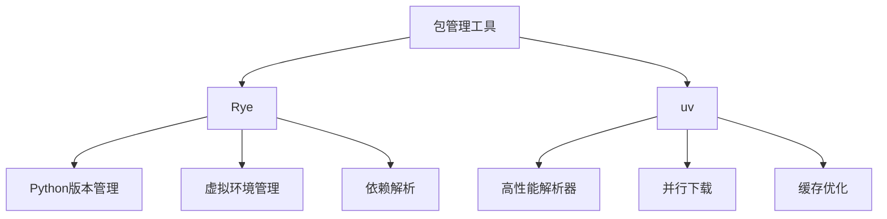

让我对 Rye 和 uv 这两个 Python 包管理工具进行对比分析。

### 1. 基础特征对比



### 2. 形式化特征分析

1. **依赖解析模型**
```python
# Rye 依赖解析
RyeResolver = {
    'strategy': 'Conservative',
    'resolution': Sequential,
    'caching': 'File-based'
}

# uv 依赖解析
UvResolver = {
    'strategy': 'Aggressive',
    'resolution': Parallel,
    'caching': 'Memory-optimized'
}
```

2. **性能特征**
```python
Performance = {
    'Rye': {
        'resolution_time': O(n),
        'install_time': O(n),
        'memory_usage': 'Moderate'
    },
    'uv': {
        'resolution_time': O(log n),
        'install_time': O(log n),
        'memory_usage': 'Optimized'
    }
}
```

### 3. 功能对比

1. **包管理功能**

| 功能 | Rye | uv |
|------|-----|-----|
| 依赖解析 | ✓ | ✓ |
| 虚拟环境 | ✓ | - |
| Python版本管理 | ✓ | - |
| 并行安装 | - | ✓ |
| 缓存优化 | 基础 | 高级 |
| 锁文件支持 | ✓ | ✓ |

2. **命令对比**
```bash
# Rye 命令
rye sync              # 同步依赖
rye add package       # 添加依赖
rye remove package    # 移除依赖
rye pin              # 固定依赖版本

# uv 命令
uv pip install       # 安装依赖
uv pip compile      # 编译依赖
uv pip sync         # 同步依赖
```

### 4. 架构特征

1. **Rye 架构**
```python
class RyeArchitecture:
    def __init__(self):
        self.python_manager = PythonVersionManager()
        self.venv_manager = VirtualEnvManager()
        self.dependency_resolver = DependencyResolver()
        
    def resolve_dependencies(self):
        """顺序依赖解析"""
        pass
        
    def manage_environments(self):
        """环境管理"""
        pass
```

2. **uv 架构**
```python
class UvArchitecture:
    def __init__(self):
        self.parallel_resolver = ParallelResolver()
        self.cache_manager = CacheManager()
        self.package_installer = PackageInstaller()
        
    async def resolve_dependencies(self):
        """并行依赖解析"""
        pass
        
    def optimize_installation(self):
        """安装优化"""
        pass
```

### 5. 性能优化策略

1. **Rye 优化**
```python
# 缓存策略
RyeCache = {
    'type': 'file_based',
    'scope': 'project',
    'strategy': 'conservative'
}

# 安装策略
RyeInstall = {
    'method': 'sequential',
    'verification': 'strict'
}
```

2. **uv 优化**
```python
# 缓存策略
UvCache = {
    'type': 'memory_optimized',
    'scope': 'global',
    'strategy': 'aggressive'
}

# 安装策略
UvInstall = {
    'method': 'parallel',
    'verification': 'optimized'
}
```

### 6. 使用场景分析

1. **适用场景对比**
```markdown
Rye 适用场景：
- 完整项目管理
- 需要Python版本管理
- 强调环境隔离
- 团队协作项目

uv 适用场景：
- 高性能依赖安装
- 大规模项目
- CI/CD 环境
- 注重安装速度
```

2. **选择建议**
```python
def choose_tool(project):
    if project.needs_full_management:
        return 'Rye'
    elif project.needs_performance:
        return 'uv'
    elif project.is_large_scale:
        return 'uv'
    else:
        return 'Rye'
```

### 7. 集成方案

1. **混合使用策略**
```python
class HybridStrategy:
    def __init__(self):
        self.rye = RyeManager()
        self.uv = UvManager()
        
    def optimize_workflow(self):
        """
        使用 Rye 管理环境和版本
        使用 uv 进行依赖安装
        """
        self.rye.setup_environment()
        self.uv.install_dependencies()
```

2. **工具链集成**
```bash
# 配置示例
tools:
  rye:
    version_management: true
    environment_setup: true
  uv:
    dependency_installation: true
    cache_optimization: true
```

### 8. 最佳实践建议

1. **Rye 最佳实践**
```python
# pyproject.toml
[project]
name = "my-project"
dependencies = [
    "package1>=1.0.0",
    "package2==2.1.0"
]

# 使用建议
1. 使用 rye sync 保持依赖同步
2. 定期更新锁文件
3. 利用虚拟环境隔离
```

2. **uv 最佳实践**
```python
# requirements.txt
package1>=1.0.0
package2==2.1.0

# 使用建议
1. 利用并行安装提升速度
2. 合理使用缓存机制
3. 在 CI/CD 中优化构建
```

### 9. 未来发展趋势

1. **工具融合**
```markdown
- Rye 可能增加性能优化特性
- uv 可能扩展项目管理功能
- 两者可能在某些领域融合
```

2. **发展方向**
```markdown
Rye:
- 更完善的项目管理
- 更好的团队协作支持
- 性能优化

uv:
- 更多的管理功能
- 更好的工具集成
- 继续优化性能
```

这个分析展示了 Rye 和 uv 各自的优势和特点。在实际使用中，可以根据项目需求选择合适的工具，或者采用混合策略来获得最佳效果。如果您需要某个具体方面的深入分析，我很乐意为您提供更详细的信息。